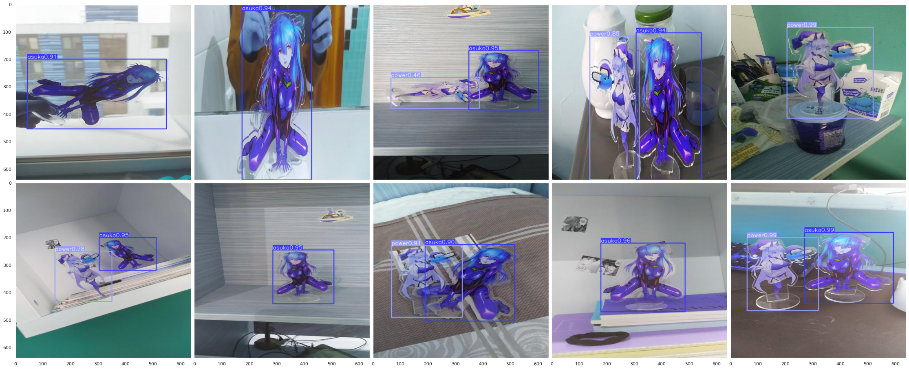

# Assignment I: Faster R-CNN vs YOLOv8
____________________________________
### Robert Chen, B20-AI

### Colab link: [here](https://colab.research.google.com/drive/1X_KTitVSw64VgfHNMhG69WtlaiBDEEn6)
____________________________________
## 1. Dataset & Objects

I decided to pick my acrylic figurines of **Asuka** (on the right) and **Power** (on the left) (anime characters from Neon Genesis Evangelion and Chainsawman) as target objects for the task.

After taking 100 photos of them in different locations (workplace, kitchen, bathroom, fridge), they were annotated in the RoboFlow and generated into the dataset with 70%-20%-10% train-validation-test split.

____________________________________
## 2. Training Faster R-CNN using detectron2

*Detectron2* offers a huge variety of different pretrained models:

The one I was using is *Faster R-CNN X101-FPN*, although it was quite a blunder, since *R101-FPN* is better.

Since *detectron2* is not very intuitive, I used this [blog](https://blog.roboflow.com/how-to-train-detectron2/) and code snippets from this Colab [notebook](https://colab.research.google.com/github/roboflow-ai/notebooks/blob/main/notebooks/train-detectron2-segmentation-on-custom-data.ipynb#scrollTo=7S8y2W2AQvJq)
in order to train and evaluate my model.

The results were very solid even in some complicated test cases:

__________________________________
## 3. Training YOLOv8

*Ultralytics* package does not provide very flexible functionality like *detectron2* does, but on the other hand, it is much easier to use.
All I needed to make it work was the official [documentation](https://docs.ultralytics.com/python/).

As for the results, *Faster R-CNN* was much better than *YOLOv8* in terms of probabilities on the test set.

*YOLOv8* test predictions for the comparison:

__________________________________
## 4. Comparison

More detailed explanation with metrics can be found in the Colab [notebook](https://colab.research.google.com/drive/1X_KTitVSw64VgfHNMhG69WtlaiBDEEn6).

In short, *Faster R-CNN* is more robust, but also much bigger in size and much slower. *YOLOv8* suits better for real-time tasks (Reinforcement Learning, Robotics, for example), since its inference time is much faster.
